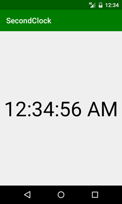

# SecondClock

Very simple clock app for Android with seconds (which I missed on my phone).

## Features

- Time formatting according to current locale and (on API 22+) to user's 12/24-hour settings
- Text resizing to fit the screen (approximately)

## Installation

This is an Android Studio project.

## License

Project is distributed under MIT license, feel free to use it.
